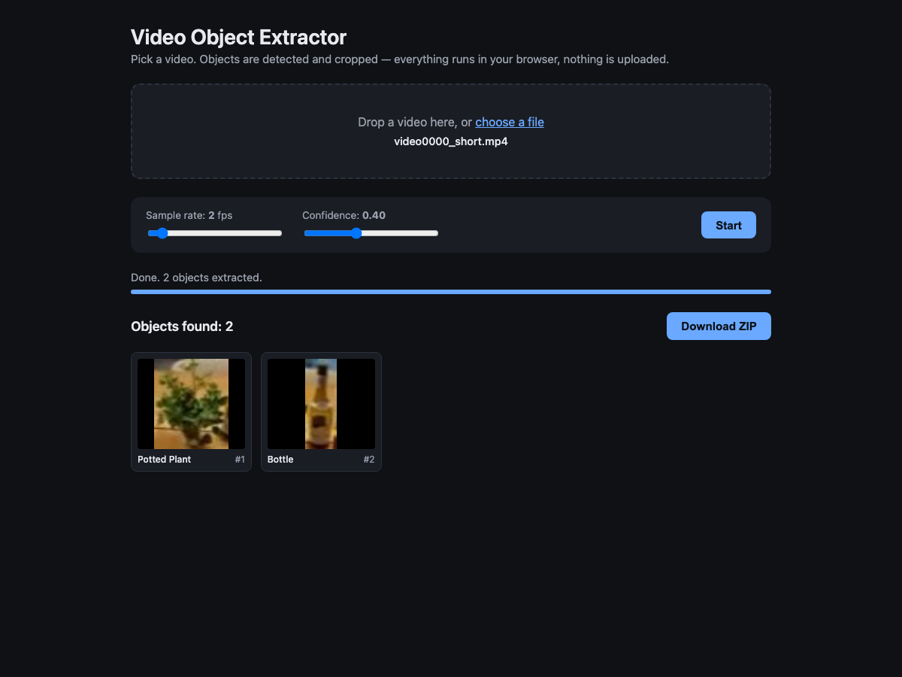

# Video Object Extractor

Drop in a video, get back one cropped image per unique object detected. Everything runs in your browser — no upload, no backend.



## How it works

```
Video file → seek frames → YOLOv10n (transformers.js) → IoU tracker → ZIP of crops
```

- **Frame extraction** seeks the `<video>` element at a configurable sample rate (default 5 fps) and draws each frame to a canvas.
- **Detection** runs YOLOv10n via [transformers.js](https://huggingface.co/docs/transformers.js), using WebGPU when available and falling back to WASM.
- **Tracking** uses greedy IoU matching to assign a stable ID to each object across frames, so the same car in 50 frames produces one image, not 50.
- **Best-crop selection** keeps the crop with the highest `confidence × √area` per ID — the most confident, reasonably-sized view of each object.
- **Output** is a ZIP containing each crop as a JPEG plus a `manifest.json` with id, label, confidence, timestamp, and bbox.

## Run locally

```bash
cd app
npm install
npm run dev
```

Then open <http://localhost:5173/>, drop in a video, click **Start**.

The first run downloads the YOLOv10n weights (~12 MB) from the HuggingFace CDN; subsequent runs use the browser cache.

## Build

```bash
cd app
npm run build      # → app/dist/
npm run preview    # serve the production build locally
```

The whole app is static — `dist/` can go on GitHub Pages, Netlify, Cloudflare Pages, or any CDN.

## Controls

| Control | Default | Effect |
|---|---|---|
| **Sample rate** | 5 fps | Lower = faster, may miss brief objects. Higher = thorough, slower. |
| **Confidence** | 0.40 | Minimum detection score (0–1). Raise to suppress false positives. |

## Tech stack

- [Vite](https://vite.dev/) + TypeScript (no framework)
- [@huggingface/transformers](https://www.npmjs.com/package/@huggingface/transformers) for in-browser inference
- [onnx-community/yolov10n](https://huggingface.co/onnx-community/yolov10n) — 80 COCO classes
- [JSZip](https://stuk.github.io/jszip/) for the downloadable archive

## Limitations

- **Small objects in high-res video** can be missed. YOLOv10n internally resizes to ~640px, so anything that ends up under ~20px is hard to detect.
- **WASM is slow.** On a device without WebGPU, expect a few seconds per frame. Trim long videos or lower the sample rate.
- **Browser video codec support** is the user's. Chrome and Edge are most permissive; Safari may reject older containers. Convert with `ffmpeg -i input.3gp output.mp4` if a file won't load.
- **Tracking is IoU-only**, no re-identification. An object that leaves the frame and returns will get a new ID.

## License

The model weights ([yolov10n](https://huggingface.co/onnx-community/yolov10n)) are AGPL-3.0. This repo's source is unlicensed by default — add one if you plan to distribute.
